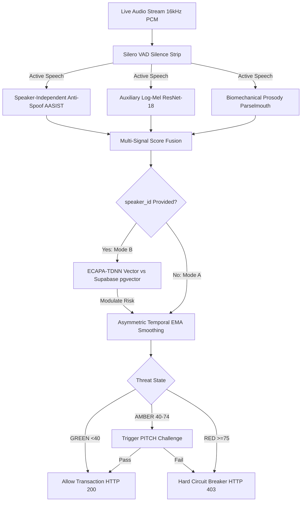

# VaaniShield (वाणिShield)

### Real-Time Speaker-Independent AI Voice Deepfake Detection & Voice Integrity Platform

[](https://fastapi.tiangolo.com)
[](https://nextjs.org)
[](https://react.dev)
[](https://www.typescriptlang.org)
[](https://www.python.org)
[](https://supabase.com)
[](https://sqlite.org)
[](https://redis.io)
[](https://onnxruntime.ai)
[](https://www.docker.com)

> **VaaniShield** is a real-time, speaker-independent AI voice deepfake detection and voice-integrity risk engine. It analyzes streaming audio to detect whether speech is synthetic, cloned, converted, replayed, or manipulated — **without requiring the caller to be pre-enrolled**. By fusing waveform-level anti-spoofing models, auxiliary acoustic vocoder cues, biomechanical prosody, and active challenge-response (**PITCH**), VaaniShield enforces deterministic pre-transaction circuit breakers (`POST /v1/transaction/evaluate-authorization` returning HTTP 403) to halt financial fraud before monetary loss occurs.

---

## Table of Contents

1. [Core Product Thesis](#core-product-thesis)
2. [Why Unknown Callers Can Be Analyzed](#why-unknown-callers-can-be-analyzed)
3. [The Mass-User Problem Statement](#the-mass-user-problem-statement)
4. [Two Operational Modes](#two-operational-modes)
5. [How Deepfake Detection Works Conceptually](#how-deepfake-detection-works-conceptually)
6. [AI & Signal Processing Architecture](#ai--signal-processing-architecture)
7. [Research-Grounded Model Strategy (AASIST / RawNet2)](#research-grounded-model-strategy-aasist--rawnet2)
8. [Optional Identity Verification (Mode B)](#optional-identity-verification-mode-b)
9. [Active Defense: PITCH Challenge-Response](#active-defense-pitch-challenge-response)
10. [Pre-Transaction Authorization Gate](#pre-transaction-authorization-gate)
11. [Continual / Self-Learning Pipeline](#continual--self-learning-pipeline)
12. [Dual-Database & Zero-Cost Architecture](#dual-database--zero-cost-architecture)
13. [Privacy Architecture (DPDP Act 2023)](#privacy-architecture-dpdp-act-2023)
14. [Current Implementation Maturity Status](#current-implementation-maturity-status)
15. [Getting Started (Local Docker Compose)](#getting-started-local-docker-compose)
16. [API & WebSocket Specifications](#api--websocket-specifications)
17. [Telephony Constraints & Physical Realities](#telephony-constraints--physical-realities)
18. [Project Team & Ownership](#project-team--ownership)
19. [Git Safety Protocol](#git-safety-protocol)
20. [Disclaimer](#disclaimer)

---

## Core Product Thesis

> **VaaniShield is primarily a real-time, speaker-independent AI voice deepfake detection and voice-integrity risk engine.**

The primary product capability is answering:
> **"Does this incoming voice stream contain evidence of AI-generated, cloned, converted, or replayed speech?"**

Speaker verification is an **optional secondary capability**, not the primary detection mechanism.

```text
Speaker Verification  = "Who does this voice sound like?" (Requires prior enrollment)
Deepfake Detection    = "Does this speech show evidence of synthesis/spoofing?" (Zero enrollment required)
Voice Integrity       = Combined evidence from anti-spoofing, prosodic physics, temporal behavior,
                        optional identity verification, and transactional context.
```

---

## Why Unknown Callers Can Be Analyzed

Legacy voice biometrics fail against mass-market fraud because they require victims to pre-record reference voice samples. Fraudsters weaponize voice cloning against:
* Citizens facing **digital arrest** extortion calls.
* Families targeted by urgent **ransom scams**.
* Call centers handling **first-time callers**.

VaaniShield solves this by analyzing **physical speech generation properties** rather than personal identity:
1. **Waveform & Spectral Artifacts**: Neural vocoders (HiFi-GAN, BigVGAN) leave phase discontinuities and transposed convolution checkerboard patterns that do not exist in human speech.
2. **Biomechanical Vocal Tract Limits**: Neural TTS models struggle to replicate physical laryngeal physics, producing unnatural pitch flatness ($F_0$), robotic jitter, and abnormal shimmer.
3. **Conversational Synthesis Latency**: Real-time neural voice conversion introduces noticeable transmission and processing delays ($>1.5\text{ s}$).

These physical properties allow VaaniShield to detect deepfakes from **any caller instantly**, with zero reference audio.

---

## Two Operational Modes

```
┌──────────────────────────────────────────────────────────────────────────────────────────────────┐
│                                    VAANISHIELD PRODUCT MODES                                     │
├─────────────────────────────────────────────────┬────────────────────────────────────────────────┤
│ MODE A: UNIVERSAL DEEPFAKE DETECTION            │ MODE B: ENHANCED IDENTITY + INTEGRITY          │
│ (Mass-User / Default / Zero Enrollment)         │ (Known-User / Optional Enrollment)             │
├─────────────────────────────────────────────────┼────────────────────────────────────────────────┤
│ • Applicable to unknown, first-time, or guest   │ • Requires pre-enrolled voiceprint baseline    │
│ • Zero voice database required                  │ • Verifies claimed identity via ECAPA-TDNN     │
│ • Speaker-independent anti-spoof model (AASIST) │ • Anti-spoof engine runs unconditionally       │
│ • Biomechanical prosody analysis (Praat/SciPy)  │ • High similarity + High synthetic risk = RED  │
│ • Output: Synthetic Risk Score (0-100), State   │ • Output: Composite Voice Integrity Score      │
└─────────────────────────────────────────────────┴────────────────────────────────────────────────┘
```

---

## How Deepfake Detection Works Conceptually



---

## Research-Grounded Model Strategy (AASIST / RawNet2)

Rather than relying on academic paper benchmarks, VaaniShield grounds model selection in the **ASVspoof 2021** and **ASVspoof5** research benchmarks:

* **Primary Engine: AASIST / AASIST-L (Integrated Spectro-Temporal Graph Attention)**:
  * Official repository: `clovaai/aasist` (Jung et al., Interspeech 2021).
  * Direct raw waveform processing using SincNet filters and heterogeneous graph attention.
  * AASIST-L variant contains only ~290K parameters, executing in $<25\text{ ms}$ on standard edge CPUs.
  * *Discipline Rule*: Published paper benchmarks (e.g. $0.83\%$ EER) are external reference figures, not VaaniShield results.
* **Reference Model: RawNet2**:
  * Established ASVspoof baseline using raw waveform convolutions and GRUs.
* **Auxiliary Signal: ResNet-18 Log-Mel Detector**:
  * 2D CNN detecting frequency-domain vocoder artifacts; retained as a supporting acoustic cue.

---

## Optional Identity Verification (Mode B)

When an enterprise caller has enrolled a voiceprint (`POST /v1/enroll`):
* ECAPA-TDNN extracts a 192-dimensional vector compared via `pgvector` cosine similarity.
* **Critical Security Principle**:
  ```text
  High speaker similarity DOES NOT mean speech is genuine.
  ```
  A cloned voice is designed to sound like the victim. If speaker similarity is high ($>0.85$) but anti-spoof risk is elevated ($>75.0$), VaaniShield triggers **RED (Targeted Clone Impersonation Attack)**.

---

## Active Defense: PITCH Challenge-Response

**PITCH (Phonetic Instability & Transient Challenge for Humans)** is an active verification mechanism triggered on **AMBER** threat states:
1. Prompts the caller with unpredictable, phonetically complex Hindi/English tongue-twisters (e.g., *"Pital ke bartan mein papita peela peela"*).
2. **Exposes Conversion Latency**: Real-time neural voice conversion tools introduce noticeable processing lag ($>1.5\text{ s}$).
3. **Breaks Neural Vocoders**: Rapid aspirated plosives and retroflex consonants cause neural vocoders to stutter, phase-smear, and glitch.
4. **Validates Organic Pitch Excursion**: Verifies dynamic biological pitch inflection ($\Delta F_0 > 45\text{ Hz}$).

---

## Pre-Transaction Authorization Gate

The platform provides a synchronous circuit breaker (`POST /v1/transaction/evaluate-authorization`) responding in $<35\text{ ms}$:

| Threat State | Risk Score | Transaction Amount | Gate Decision | HTTP Status | Action Enforced |
| :--- | :--- | :--- | :--- | :--- | :--- |
| **GREEN** | $0.0 - 39.9$ | Any amount | `APPROVED` | `200 OK` | Payment proceeds immediately. |
| **AMBER** | $40.0 - 74.9$ | $< \text{₹}10,000$ | `APPROVED_WITH_WARNING` | `200 OK` | Proceeds with SMS notification. |
| **AMBER** | $40.0 - 74.9$ | $\ge \text{₹}10,000$ | `PENDING_CHALLENGE` | `428 Precondition`| Paused until PITCH challenge passes. |
| **RED** | $\ge 75.0$ | Any amount ($> \text{₹}0$) | `BLOCKED` | `403 Forbidden` | **Deterministic Hard Block**. |

---

## Continual / Self-Learning Pipeline

VaaniShield improves detection over time through a controlled, batched learning architecture:
* **No Blind Retraining**: The model is never retrained automatically after individual calls.
* **Local Event Logging**: Model predictions, feature summaries, and operator feedback are logged into a local SQLite registry (`vaani_learning.db`).
* **Poisoning Defense**: Feedback from untrusted sources is quarantined; outliers and near-duplicate vectors are rejected.
* **Holdout Validation Gate**: Retrained candidate models must demonstrate improved Equal Error Rate (EER) on an immutable benchmark holdout set before promotion.
* **Instant Rollback**: If performance degrades, the system instantly rolls back to the prior version tag via environment configuration.

---

## Dual-Database & Zero-Cost Architecture

> **Hard Project Constraint: The core architecture is designed so that no paid API is required.**

1. **Supabase (PostgreSQL 16 + pgvector)**:
   * Operates within the **Supabase Free Tier** ($0/month, 500 MB DB, 1 GB storage, up to 50k MAU).
   * Houses persistent application state: call sessions, transaction evaluations, and Mode B voiceprints.
2. **SQLite (`vaani_learning.db`)**:
   * Local, file-based embedded database for high-throughput ML telemetry, feedback records, and candidate retraining batches with zero server cost.
3. **Local Runtimes**: Core inference runs locally via ONNX Runtime and PyTorch (CPU utility) without paid cloud GPU services or proprietary speech APIs.

---

## Privacy Architecture (DPDP Act 2023)

* **Zero Raw Audio at Rest**: No audio files (`.wav`, `.pcm`) are ever written to disk or permanent database tables.
* **Ephemeral In-Memory Buffers**: Audio frames reside in volatile RAM within Redis circular ring buffers governed by a mandatory **15-second TTL** (`EXPIRE 15`), purged on disconnect.
* **Mathematical Telemetry Only**: Audit logs store derived non-invertible feature scalars ($F_0$, jitter, mel-band energies), never raw speech.

---

## Current Implementation Maturity Status

```
┌──────────────────────────────────────────────────────────────────────────────────────────────────┐
│                                CURRENT IMPLEMENTATION MATURITY MATRIX                            │
├──────────────────────┬─────────────────────────┬─────────────────────────────────────────────────┤
│ Implementation State │ Subsystem / Component   │ Empirical Repository Status (`Voice-Cloning`)   │
├──────────────────────┼─────────────────────────┼─────────────────────────────────────────────────┤
│ IMPLEMENTED          │ WebSocket Transport     │ Full-duplex WS at /v1/stream/call/{session_id}   │
│                      │ Redis Ring Buffer       │ LPUSH + LTRIM with 15s EXPIRE; deque fallback   │
│                      │ Threat State Machine    │ ThreatState class with asymmetric EMA smoothing │
│                      │ Transaction Gate API    │ POST /v1/transaction/evaluate-authorization     │
│                      │ Speaker Enrollment API  │ POST /v1/enroll extracting & persisting vectors │
│                      │ Frontend Dashboard      │ Next.js 16, Zustand store, ThreatDial, Gate UI │
│                      │ Biomechanical Prosody   │ Praat Parselmouth extracts F0, Jitter, Shimmer  │
├──────────────────────┼─────────────────────────┼─────────────────────────────────────────────────┤
│ MOCK / FALLBACK      │ Neural Anti-Spoofing    │ Heuristic fallback when resnet18.onnx is absent │
│                      │ Silero VAD              │ RMS energy thresholding when ONNX is absent     │
│                      │ ECAPA-TDNN Embedding    │ Hash-seeded unit vectors when model is absent   │
│                      │ PITCH Challenge Logic   │ Static UI drawer; lacks backend acoustic check  │
├──────────────────────┼─────────────────────────┼─────────────────────────────────────────────────┤
│ PLANNED / RESEARCH   │ Primary Anti-Spoof Model│ Integration of pretrained AASIST-L ONNX model   │
│                      │ Closed-Loop PITCH Check │ Backend response latency and intonation check   │
│                      │ Telephony Transcoding   │ AMR-NB/WB bandpass simulation filter            │
├──────────────────────┼─────────────────────────┼─────────────────────────────────────────────────┤
│ PROPOSED             │ Dual Database Topology  │ Supabase Free (PostgreSQL/vector) + SQLite log  │
│                      │ Self-Learning Registry  │ SQLite metadata logging with validation gates   │
│                      │ Anti-Poisoning Controls │ Quarantine pool and holdout evaluation runner   │
├──────────────────────┼─────────────────────────┼─────────────────────────────────────────────────┤
│ UNVERIFIED           │ Telephony Codec EER     │ Anti-spoof EER under real 8kHz AMR-NB cell calls│
│                      │ Multi-Accent Resiliency │ False positive rates on regional Indian accents │
└──────────────────────┴─────────────────────────┴─────────────────────────────────────────────────┘
```

---

## Getting Started (Local Docker Compose)

```bash
# 1. Clone repository
git clone https://github.com/Sayan-Mukherjee99/Voice-Cloning-Prototype.git
cd Voice-Cloning-Prototype

# 2. Launch complete stack (FastAPI, Redis, PostgreSQL/pgvector, Next.js)
docker compose up -d

# 3. Access interfaces
# Next.js SecOps Dashboard:  http://localhost:3000
# FastAPI Interactive Docs:   http://localhost:8000/docs
# System Health Diagnostic:   http://localhost:8000/health
```

---

## API & WebSocket Specifications

* **WebSocket Audio Stream**: `WS /v1/stream/call/{session_id}` (Accepts binary 16kHz 16-bit linear PCM in 1,024-sample frames; emits telemetry JSON every 768ms).
* **Pre-Transaction Gate**: `POST /v1/transaction/evaluate-authorization` (Accepts `session_id`, `amount_inr`, `beneficiary_vpa`; returns HTTP 200 on GREEN, HTTP 403 on RED).
* **Speaker Enrollment**: `POST /v1/enroll` (Mode B voiceprint registration accepting base64 audio).
* **Diagnostics**: `GET /health` (Reports container and model runtime availability).

---

## Telephony Constraints & Physical Realities

* **Mobile OS Sandboxing**: Neither iOS nor Android permits third-party apps to tap raw cellular voice calls. VaaniShield integrates at enterprise softphones, WebRTC clients, and carrier SBC media-forking gateways.
* **Lossy Codec Filtering**: Mobile voice codecs (AMR-NB at 8 kHz) strip acoustic frequencies above $3.4\text{ kHz}$. VaaniShield uses lower-band biomechanical prosody and active challenge-response (PITCH) to maintain detection.

---

## Project Team & Ownership

* **Person A — Shub (Backend / AI Lead)**: Architecture, audio ingestion, anti-spoof model integration, prosody extraction, risk engine, Supabase/SQLite databases, and security gates.
* **Person B — Sion (Frontend Lead)**: Next.js 16 UI, canvas waterfall, prosody time-series, ThreatDial, Mock UPI gate, PITCH drawer, and client networking.

---

## Git Safety Protocol

Under mandatory project policy, automated coding agents are **strictly prohibited** from running `git push`, merging to `main`, releasing tags, or modifying remote Git configurations without explicit human authorization.
